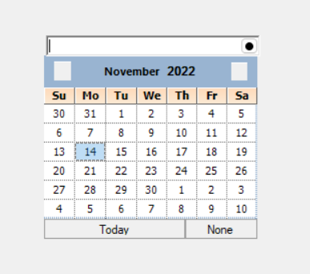

# How-to-create-a-DatePicker-in-Winforms-using-ButtonEdit-and-MonthCalendarAdv
Create a DatePicker using ButtonEdit and MonthCalendarAdv

# C#
            MonthCalendarAdv monthCalendarAdv = new MonthCalendarAdv();
            public Form1()
            {
                InitializeComponent();

                childButton.Click += ChildButton_Click;

                calendarPopup.Controls.Add(monthCalendarAdv);
                buttonEdit1.Buttons.Add(childButton);
                tableLayoutPanel1.Controls.Add(calendarPopup, 0, 1);
                monthCalendarAdv.DateSelected += MonthCalendarAdv_DateSelected;
            }

            private void MonthCalendarAdv_DateSelected(object sender, EventArgs e)
            {
                buttonEdit1.TextBox.Text = monthCalendarAdv.Value.ToString();
                calendarPopup.Visible = false;
            }

            private void ChildButton_Click(object sender, EventArgs e)
            {
                calendarPopup.Visible = true;
            }

.
